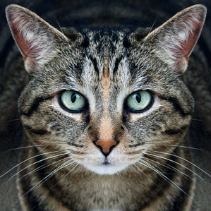

# Adversarial synthesis on InceptionV3 in PyTorch

This repo is an implementation of [Anish Athalye's blog post](https://anishathalye.com/synthesizing-adversarial-examples/) on adversarial examples for image classification in PyTorch.

Given a source image classified as a **tabby cat**:

It produces an adversarial image with very slight perturbations but no visible differences that's classified as a **sombrero**:

Or a **bagel**:

Currently *does not* support transformations.